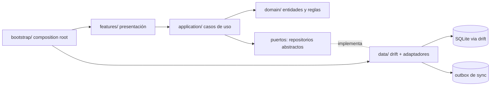

# Arquitectura CrediRuta

Basada en `23-recommended-target-architecture.md` de la auditoría de descubrimiento.
Monolito modular Flutter, feature-first, offline-first, con dominio Dart puro.

## Capas

### Reglas de dependencia

| Capa | Puede importar | Prohibido |
|---|---|---|
| `domain` | `core` (Dart puro) | Flutter, drift, Firebase, HTTP, IO |
| `application` | `domain`, `core` | Flutter, drift, Firebase, HTTP |
| `data` | `application` (puertos), `domain`, `core`, drift, path_provider | Widgets, reglas de negocio |
| `features` | `application`, `domain`, `ui`, `core`, Flutter | `data` (lo inyecta bootstrap) |
| `ui` | Flutter, `core` | negocio, `data`, `application` |
| `bootstrap` | todo | — |

### Presentación (`features/`)

- Una carpeta por feature: `auth`, `organization`, `routes`, `customers`, `loans`,
  `payments`, `cash`, `expenses`, `closures`, `reports`, `settings`, `shell`.
- Cada flujo tiene un **controller** (`ChangeNotifier`) creado por el composition root,
  con dependencias por constructor. Los widgets no instancian repositorios.
- Estados explícitos: `loading / data / empty / error / offline / pendingSync`.
- Sin fórmulas financieras ni SDKs externos en widgets.

### Aplicación (`application/`)

- Comandos y queries como casos de uso (`RegisterPayment`, `DisburseLoan`, `CloseCashSession`...).
- Devuelven `Result<T>` con `Failure` tipada; nunca lanzan excepciones de negocio.
- Coordinan repositorios dentro de una **unidad de trabajo** (transacción).
- Consumen políticas de autorización (rol/membresía) antes de mutar.

### Dominio (`domain/`)

- Entidades y agregados: `Organization`, `Membership`, `RouteEntity`, `Customer`,
  `Loan` + `LoanMovement` (ledger), `Payment`, `CashSession` + `CashMovement`,
  `Expense`, `Closure` (versionado), `Visit`, `Boleta`, `Invitation`.
- Value objects: `Money` (COP entero), `InterestRate`, `PaymentSchedule` (calendario por
  préstamo: fecha de desembolso + frecuencia + n.º de cuotas, Q-B14), `OperationalDate`.
- Máquinas de estado explícitas (préstamo, cierre, ruta, membresía).
- Saldos y estados de cartera **derivados del ledger**, nunca duplicados como fuente de verdad.

### Datos (`data/`)

- drift (SQLite) con schema versionado y migraciones; índices por organización, ruta,
  cliente, fecha operativa y estado.
- Tabla `outbox` con idempotency key para sincronización futura (fase backend).
- Repositorios locales implementan los puertos; mappers DTO↔entidad separados.
- Media (fotos) fuera de la DB, con manifest (id, owner, checksum, mime).

## Multi-tenant

La raíz de autorización es la **Organización** (Q-B05). Todo registro operativo lleva
`organizationId`. Un `Membership` une usuario+organización con rol
(`adminPrincipal | coadmin | cobrador`) y estado. El cobrador solo ve/opera **rutas
asignadas** (Q-B07). Solo el admin principal crea/invita administradores (Q-B06).

## Offline-first y sync (fase posterior)

1. El caso de uso valida y escribe la transacción local.
2. Añade evento a `outbox` con idempotency key.
3. La UI muestra "confirmado local / pendiente de sync".
4. Un worker enviará lotes al backend (documentado en `docs/backend/`).
5. Conflictos: movimientos financieros = append + idempotencia (nunca last-write-wins);
   perfiles = versión/merge; asignaciones = compare-and-set; borrados = tombstones.

## Errores

Jerarquía única en `core/errors`: `ValidationFailure`, `AuthorizationFailure`,
`NotFoundFailure`, `ConflictFailure`, `OfflineFailure`, `PersistenceFailure`,
`IntegrationFailure`, `CorruptDataFailure`, `UnexpectedFailure`.
La UI traduce cada `Failure` a copy accionable en español.

## Navegación

`go_router` centralizado en `bootstrap/router.dart`:

- redirect por estado de sesión y rol activo (guard uniforme, no por pantalla);
- shell admin: Resumen, Rutas, Clientes, Equipo, Config (5 tabs);
- shell cobrador: Ruta, Clientes, Gastos, Cierre (4 tabs);
- rutas tipadas por constantes; sin strings repetidos.

Los guards visuales complementan la autorización de casos de uso, no la reemplazan.

## Pruebas

- Dominio puro: unit tests rápidos (fórmulas, calendario, ledger, estados).
- Casos de uso: fakes de repositorio en memoria.
- Data: tests de integración drift (NativeDatabase.memory) y migraciones.
- Widgets: flujos críticos por feature.
- Regla: ninguna mutación financiera sin test.
