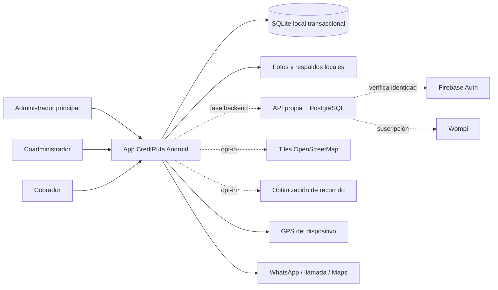
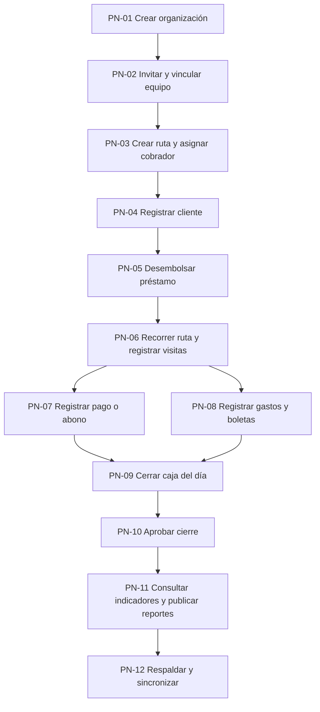
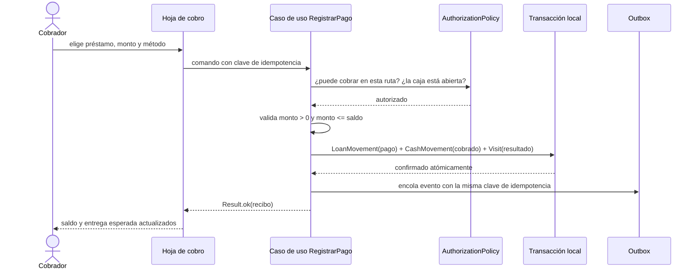

# Especificación de requerimientos — CrediRuta

Documento de requerimientos funcionales y no funcionales del sistema. Consolida la
auditoría de descubrimiento (`project-discovery-based-cobromaster/`), las decisiones de
arquitectura (`architecture/adr.md`), los contratos de diseño (`design/contratos/`) y la
especificación del backend (`backend/`).

| Dato | Valor |
|---|---|
| Producto | CrediRuta (marcas heredadas: CobroMaster, Presta Ya — ADR-001, contrato 05) |
| Versión del documento | 1.0 |
| Fecha | 2026-08-31 |
| Alcance de la versión | v1 Android, local-first; backend y suscripciones en fase posterior |
| Fuentes | docs 01–28 de la auditoría, ADR-001…015, `decisions/open-questions.md`, contratos 02/04/05, `design/app/SPEC.md` |

---

## 0. Cómo leer este documento

### 0.1 Convenciones de identificación

| Prefijo | Significado |
|---|---|
| `RF-XXX-nnn` | Requerimiento funcional |
| `RNF-XXX-nnn` | Requerimiento no funcional |
| `VAL-XXX-nnn` | Regla de validación |
| `PN-nn` | Proceso de negocio |
| `MR-FUN-nnn` / `MR-NF-nnn` | Requisito de reconstrucción heredado del doc 22 |
| `BR-…` | Regla de negocio del sistema anterior (doc 06) |
| `AC-…` | Criterio de aceptación del doc 20 |
| `Q-…` | Pregunta abierta al cliente (doc 21, `open-questions.md`) |

### 0.2 Prioridad

`P0` imprescindible para operar · `P1` necesario para la versión comercial ·
`P2` mejora planificada · `P3` diferido a la fase backend.

### 0.3 Verificabilidad

Cada requerimiento funcional lleva un **criterio de aceptación** observable: se puede
escribir como prueba automatizada o como paso de aceptación manual. Cada requerimiento no
funcional lleva **métrica** y **método de verificación**. Un requerimiento sin criterio
medible no está terminado y se marca como pendiente.

### 0.4 Equivalencia de términos de la rúbrica

La rúbrica de evaluación usa vocabulario de otro dominio. Su equivalente aquí:

| Término de la rúbrica | Equivalente en CrediRuta | Dónde se cubre |
|---|---|---|
| Publicaciones | Generación, exportación y distribución de reportes, cierres y respaldos | §4.10 |
| Logros | Metas de recaudo, hitos de cartera e indicadores de desempeño | §4.11 |
| Gestión de investigación | Gestión del activo central del negocio: la cartera de préstamos y su seguimiento | §4.5 y §4.6 |

No se inventaron funciones para encajar en la rúbrica: se nombran las del dominio real.

---

## 1. Contexto y alcance

### 1.1 Problema

Un negocio de préstamo informal opera por rutas: un cobrador recorre a diario un grupo de
clientes, cobra cuotas, presta dinero nuevo, paga gastos de la jornada y al final entrega
efectivo al administrador. Hoy eso se lleva en cuadernos o en una aplicación anterior cuyo
descubrimiento demostró tres fallas estructurales: administrador y cobrador **no comparten
datos** (BR-TEAM-004), la caja **no tiene fecha** y acumula indefinidamente (BR-CASH-006),
y los movimientos financieros **no son atómicos** (BR-DATA-004).

CrediRuta reconstruye esa operación con una fuente de verdad compartida por organización,
jornada fechada y ledger auditable.

### 1.2 Dentro del alcance de la v1

- Aplicación Android nativa (Flutter) con operación completa sin conexión.
- Organización con administrador principal, coadministradores y cobradores.
- Rutas, clientes, préstamos, pagos, visitas, gastos, boletas, caja diaria y cierres.
- Indicadores, reportes, exportación XLSX, respaldo y restauración locales.
- Modo demostración aislado y reproducible.

### 1.3 Fuera del alcance de la v1

| Excluido | Motivo | Referencia |
|---|---|---|
| Cuenta para el cliente de cartera | El cliente es entidad gestionada, no usuario | Q-D02 |
| Notificaciones automáticas y recordatorios | Se conserva el envío manual por WhatsApp | Q-D03 |
| Mapas sin conexión | Tiles en línea con error explícito | Q-D04 |
| Landing web | Otro repositorio | Q-D01 |
| iOS y web | Android primero | ADR-001, Q-B02 |
| Cobro de suscripción con Wompi | Fase backend; modo local gratuito | Q-B08, ADR-011 |
| Lista compartida de mal pagadores ("clavo") | Descartada por el cliente | ADR-015, Q-I01 |

### 1.4 Contexto del sistema

---

## 2. Usuarios y roles

### 2.1 Actores

| Actor | Tipo | Descripción | Autenticado |
|---|---|---|---|
| Administrador principal | Persona | Dueño de la organización. Crea rutas, invita al equipo, aprueba cierres y consulta reportes. Único que puede crear otros administradores (Q-B06) | Sí |
| Coadministrador | Persona | Administrador invitado con permisos granulares otorgados por el principal | Sí |
| Cobrador | Persona | Recorre las rutas asignadas, registra visitas, pagos, préstamos, gastos y boletas, y cierra su caja | Sí |
| Cliente de cartera | Entidad | Recibe préstamos y paga cuotas. No tiene sesión ni acceso en la v1 | No |
| Sistema | Automático | Rehidrata datos, deriva estados, encola sincronización y genera respaldos | — |
| Proveedor de identidad | Externo | Firebase Auth verifica credenciales. Nunca define rol ni suscripción | — |
| Servicios de mapa y contacto | Externo | OSM, OSRM, WhatsApp, llamada y Google Maps. Todos opcionales y con consentimiento | — |

**Regla de autoridad (ADR-005).** Los datos pertenecen a la **organización**, nunca al UID
de quien los creó. Toda fila operativa lleva `organizationId`. Esto corrige el defecto
crítico SEC-AUTHZ-008 del sistema anterior, donde cada cuenta tenía su propio almacén
aislado y el equipo no podía ver lo mismo.

### 2.2 Matriz de permisos por rol

Leyenda: ✓ permitido · ⊘ prohibido · ◐ permitido con auditoría o restricción · — no aplica.

| Acción | Admin principal | Coadmin | Cobrador | Ver como cobrador |
|---|:--:|:--:|:--:|:--:|
| Crear la organización | ✓ | ⊘ | ⊘ | ⊘ |
| Invitar coadministrador | ✓ | ⊘ | ⊘ | ⊘ |
| Invitar cobrador | ✓ | ◐ con permiso | ⊘ | ⊘ |
| Revocar membresía | ✓ | ◐ | ⊘ | ⊘ |
| Crear o editar ruta | ✓ | ◐ | ⊘ | ⊘ |
| Archivar ruta | ✓ | ◐ | ⊘ | ⊘ |
| Asignar cobrador a ruta | ✓ | ◐ | ⊘ | ⊘ |
| Ver rutas | ✓ todas | ✓ todas | ✓ solo asignadas | solo lectura |
| Crear o editar cliente | ✓ | ✓ | ✓ en sus rutas | ⊘ |
| Archivar cliente | ✓ | ◐ | ⊘ | ⊘ |
| Transferir cliente entre rutas | ✓ | ◐ | ⊘ | ⊘ |
| Desembolsar préstamo | ✓ | ✓ | ✓ en sus rutas | ⊘ |
| Registrar pago | ✓ | ✓ | ✓ en sus rutas | ⊘ |
| Retaque, recargo o descuento | ✓ | ✓ | ◐ auditado (Q-I03) | ⊘ |
| Reversar un movimiento | ✓ | ◐ | ◐ auditado | ⊘ |
| Registrar visita | ✓ | ✓ | ✓ | ⊘ |
| Registrar gasto | ✓ | ✓ | ✓ en su caja | ⊘ |
| Cobrar boleta | ✓ | ✓ | ✓ | ⊘ |
| Enviar cierre de caja | — | — | ✓ | ⊘ |
| Aprobar o reabrir cierre | ✓ | ◐ | ⊘ | ⊘ |
| Generar y compartir reportes | ✓ | ✓ | ◐ su ruta y su día | ⊘ |
| Exportar, restaurar o restablecer | ✓ con reautenticación | ⊘ | ⊘ | ⊘ |
| Configurar tasas y frecuencias | ✓ | ◐ | ⊘ | ⊘ |
| Activar "ver como cobrador" | ✓ | ◐ | — | — |

La matriz vive en `AuthorizationPolicy` como una sola estructura de datos. Cambiar un
permiso es editar esa matriz, no tocar pantallas. Ninguna restricción se confía únicamente
a la interfaz: corrige PERM-003 y SEC-AUTHZ-001.

---

## 3. Procesos de negocio

### 3.1 Flujo maestro

### 3.2 Catálogo de procesos

| ID | Proceso | Actor principal | Disparador | Resultado esperado | RF asociados |
|---|---|---|---|---|---|
| PN-01 | Crear organización y cuenta administradora | Admin principal | Registro nuevo | Organización con membresía `adminPrincipal` activa | RF-AUT-001…005, RF-ORG-001 |
| PN-02 | Invitar, canjear y revocar membresías | Admin principal | Necesita un cobrador | Miembro vinculado con rol y estado | RF-ORG-002…010 |
| PN-03 | Crear ruta, asignar cobrador y controlar vigencia | Admin | Nueva zona de cobro | Ruta activa con cobrador asignado | RF-RUT-001…010 |
| PN-04 | Registrar y mantener clientes | Cobrador o admin | Cliente nuevo o cambio de datos | Cliente con identidad, ubicación y ruta | RF-CLI-001…011 |
| PN-05 | Desembolsar préstamo | Cobrador o admin | Cliente aprobado | Préstamo con calendario y movimiento de desembolso | RF-PRE-001…012 |
| PN-06 | Recorrer la ruta y registrar visitas | Cobrador | Inicio de jornada | Visitas con resultado, hora y actor | RF-VIS-001…008 |
| PN-07 | Registrar pago o abono | Cobrador | El cliente paga | Movimiento aplicado al préstamo y a la caja | RF-PAG-001…011 |
| PN-08 | Registrar gastos y boletas | Cobrador | Gasto de jornada o cliente nuevo | Movimientos que ajustan la entrega esperada | RF-CAJ-004…009 |
| PN-09 | Cerrar caja del día | Cobrador | Fin de jornada | Cierre `enviada` con efectivo contado y diferencia | RF-CIE-001…005 |
| PN-10 | Revisar y aprobar cierre | Admin | Cierre recibido | Cierre `aprobada`, inmutable y versionado | RF-CIE-006…009 |
| PN-11 | Consultar indicadores y publicar reportes | Admin | Corte diario, semanal o mensual | Reporte generado, versionado y compartido | RF-REP, RF-MET |
| PN-12 | Respaldar, restaurar y sincronizar | Admin o sistema | Programado o manual | Copia restaurable; outbox drenado | RF-CFG-004…008, RF-SIN |

### 3.3 Detalle del proceso crítico: PN-07 registrar pago

Las tres escrituras ocurren en **una** transacción. Si una falla, ninguna se aplica.
Es el requerimiento RNF-SEG-006 y corrige BR-DATA-004 y SEC-DATA-004.

### 3.4 Máquinas de estado

| Entidad | Estados | Transiciones permitidas |
|---|---|---|
| Membresía | `invitada → activa → suspendida → revocada` | Solo admin principal o coadmin con permiso |
| Ruta | `activa → suspendida → archivada` (y vigencia comercial `al día / por vencer / vencida`) | Estado operativo y vigencia son ejes independientes pero ambos derivados, nunca escritos a mano (corrige BR-ROUTES-005) |
| Préstamo | `activo → liquidado`; `activo → reversado` solo si el desembolso completo se anula | Liquidado se deriva del ledger (saldo = 0), no se marca |
| Caja del día | `abierta → enviada → aprobada → reabierta → enviada …` | Cobrador envía; admin aprueba y reabre. Cada reapertura crea versión (ADR-007) |
| Visita | `pendiente → registrada` | Una visita por cliente, jornada y ruta |
| Invitación | `emitida → canjeada` / `emitida → vencida` / `emitida → anulada` | Canje único (ADR-005) |

---

## 4. Requerimientos funcionales

### 4.1 Identidad y sesión (RF-AUT)

| ID | Rol | Requerimiento | Criterio de aceptación | Prior. | Trazabilidad |
|---|---|---|---|---|---|
| RF-AUT-001 | Público | El sistema permite registrarse con nombre, correo y contraseña, creando una organización nueva de la que el registrante queda como administrador principal | Tras registrarse, existe una organización con exactamente una membresía `adminPrincipal` activa y el usuario aterriza en el panel del administrador | P0 | MR-FUN-001, ADR-005 |
| RF-AUT-002 | Público | El sistema permite iniciar sesión con correo y contraseña | Credenciales válidas abren la sesión; credenciales inválidas muestran un mensaje único que no revela si el correo existe | P0 | SEC-AUTH-008 |
| RF-AUT-003 | Usuario | El sistema restaura la sesión al abrir la aplicación mostrando estados explícitos de carga, éxito y error | Con la app cerrada y reabierta sin red, la sesión se restaura desde el perfil cacheado y se muestra el indicador de modo sin conexión | P0 | MR-FUN-002, AC-AUTH-001 |
| RF-AUT-004 | Sistema | Si el perfil o la membresía no se pueden resolver, el acceso se **bloquea**; nunca se concede un rol por defecto | Simulando la ausencia del perfil, la app muestra error de sesión y no entra a ningún panel. Nunca aparece un panel de administrador | P0 | SEC-AUTH-001, AC-AUTH-001, corrige BR-AUTH-008 |
| RF-AUT-005 | Sistema | La política de verificación de correo es única: se define si es obligatoria antes de operar y esa misma regla se aplica en la app y en el backend | Un usuario sin verificar recibe el mismo tratamiento en la interfaz y en la API; no existe un plazo mostrado que la app no respete | P1 | MR-FUN-008, corrige BR-AUTH-007 |
| RF-AUT-006 | Usuario | El sistema permite cerrar sesión limpiando por completo sesión, caché de perfil, rol activo, selección de ruta y estado en memoria | Tras cerrar sesión y volver a entrar con otra cuenta, ningún dato de la cuenta anterior es visible ni en listas ni en indicadores | P0 | AC-AUTH-006, corrige BR-AUTH-012 |
| RF-AUT-007 | Usuario | El sistema permite recuperar la contraseña por correo | Solicitar recuperación envía el correo y muestra confirmación neutra, exista o no la cuenta | P1 | — |
| RF-AUT-008 | Sistema | Ni el rol, ni la membresía, ni el entitlement de suscripción son escribibles por el cliente | Una modificación directa del perfil desde el dispositivo no cambia el rol efectivo tras la siguiente resolución de sesión | P0 | SEC-AUTH-002, MR-FUN-004 |

### 4.2 Organización, equipo e invitaciones (RF-ORG)

| ID | Rol | Requerimiento | Criterio de aceptación | Prior. | Trazabilidad |
|---|---|---|---|---|---|
| RF-ORG-001 | Admin principal | El sistema modela la organización como propietaria de todos los datos operativos | Toda fila creada por cualquier miembro lleva el mismo `organizationId`; dos miembros de la misma organización ven exactamente el mismo conjunto de rutas y clientes | P0 | ADR-005, AC-TEAM-001, corrige BR-TEAM-004 |
| RF-ORG-002 | Admin | El sistema genera invitaciones con código de un solo uso, rol asignado, emisor y fecha de vencimiento | El código generado muestra rol y vencimiento; un segundo canje del mismo código se rechaza con mensaje explícito | P0 | MR-FUN-005, AC-TEAM-004 |
| RF-ORG-003 | Invitado | El sistema permite canjear el código dentro de la aplicación, sin enlaces profundos | Introducir un código válido vincula al usuario a la organización con el rol emitido; introducir uno inválido, vencido o ya usado no vincula nada | P0 | ADR-005, Q-B04, corrige BR-AUTH-005 |
| RF-ORG-004 | Sistema | Un código inexistente o arbitrario nunca produce una membresía | Registrar un cobrador con el texto "cualquiera" como código deja la cuenta sin organización y en pantalla de vinculación | P0 | AC-AUTH-003, SEC-AUTH-004 |
| RF-ORG-005 | Admin | El sistema muestra el equipo con nombre, rol, estado, rutas asignadas y fecha de última actividad real | Ningún dato de la pantalla de equipo proviene de constantes; un cobrador sin actividad muestra "sin actividad registrada" | P0 | corrige BR-TEAM-008 |
| RF-ORG-006 | Admin principal | El sistema permite invitar coadministradores y otorgarles permisos granulares | Un coadmin sin el permiso de gestión de equipo no ve la acción de invitar; el intento por API se rechaza con error de autorización | P1 | Q-B06, ADR-005 |
| RF-ORG-007 | Admin | El sistema permite revocar una membresía, retirando de inmediato el acceso a los datos de la organización | Tras revocar, el usuario removido no puede leer ni escribir datos de esa organización en su siguiente resolución de sesión | P0 | MR-FUN-006, AC-TEAM-003 |
| RF-ORG-008 | Sistema | Un miembro revocado que estaba trabajando sin conexión queda bloqueado al reconectar y sus datos pendientes quedan en revisión del administrador | Al reconectar, la app muestra el bloqueo y lista los movimientos pendientes en una bandeja de revisión, sin descartarlos | P1 | Q-I09 |
| RF-ORG-009 | Admin | El sistema ofrece "ver como cobrador" en **solo lectura**, con banner visible y registro de auditoría | En ese modo, toda acción de mutación está deshabilitada y queda un evento de auditoría con actor, cobrador observado y marca de tiempo | P1 | Q-I13, MR-FUN-007, corrige SEC-AUTH-007 |
| RF-ORG-010 | Admin | El sistema permite configurar los valores por defecto de la organización: tasa de interés, frecuencia, número de cuotas y valor de boleta | Los valores configurados aparecen precargados al crear un préstamo y pueden sobrescribirse por préstamo | P1 | Q-D06, corrige BR-LOANS-006 |

### 4.3 Rutas (RF-RUT)

| ID | Rol | Requerimiento | Criterio de aceptación | Prior. | Trazabilidad |
|---|---|---|---|---|---|
| RF-RUT-001 | Admin | El sistema permite crear una ruta con nombre, descripción, foto opcional y cobrador asignado | La ruta creada aparece en la lista con su cobrador y con cero clientes | P0 | MR-FUN-009 |
| RF-RUT-002 | Admin | El sistema permite editar los datos de una ruta y reasignar su cobrador | El cambio de cobrador es inmediato y queda registrado con actor y fecha | P0 | MR-FUN-010 |
| RF-RUT-003 | Admin | El sistema **archiva** rutas en lugar de borrarlas; una ruta archivada sale de los flujos operativos y conserva su historial consultable | Archivar una ruta con clientes no elimina ningún cliente, préstamo ni pago; todos siguen consultables desde el panel del administrador | P0 | ADR-013, Q-I02, corrige BR-ROUTES-007 |
| RF-RUT-004 | Sistema | El estado operativo de la ruta y su vigencia comercial son ejes independientes, ambos derivados | Una ruta con mensualidad vencida se muestra como vencida sin importar su estado operativo; ningún campo de estado se edita a mano | P1 | corrige BR-ROUTES-005 |
| RF-RUT-005 | Cobrador | El cobrador solo puede ver y operar las rutas que tiene asignadas | Un cobrador con una ruta asignada de tres existentes solo ve una en el selector y no puede consultar clientes de las otras dos, ni siquiera por búsqueda | P0 | AC-TEAM-002, MR-FUN-012, corrige BR-ROUTES-002 |
| RF-RUT-006 | Usuario | La ruta seleccionada es una preferencia por usuario, persistente entre sesiones y validada contra sus asignaciones vigentes | Al reabrir la app se restaura la última ruta usada; si esa ruta ya no está asignada, se selecciona la primera válida y se avisa | P1 | MR-FUN-013, corrige BR-ROUTES-001 |
| RF-RUT-007 | Cobrador | El sistema muestra el orden de recorrido de la ruta y permite reordenarlo manualmente | El orden manual persiste y es el que gobierna la lista de la jornada | P1 | MR-FUN-015, Q-I08 |
| RF-RUT-008 | Cobrador | El sistema ofrece optimización de recorrido como sugerencia explícita y opcional; el orden manual prevalece | Aplicar la optimización pide confirmación y muestra el orden propuesto antes de reemplazar el manual | P2 | Q-I08, Q-I10 |
| RF-RUT-009 | Cobrador | El sistema muestra los clientes de la ruta sobre un mapa, indicando el origen y la calidad de cada coordenada | Un cliente sin coordenada real se lista como "sin ubicación" y **nunca** se dibuja en una posición inventada | P1 | MR-FUN-016, corrige BR-GEO-001 |
| RF-RUT-010 | Cobrador | El sistema permite buscar clientes dentro de la ruta por nombre, cédula, teléfono o dirección | La búsqueda por subcadena devuelve coincidencias en los cuatro campos y muestra estado vacío diferenciado para "sin clientes" y "sin resultados" | P0 | BR-ROUTES-009 |

### 4.4 Clientes (RF-CLI)

| ID | Rol | Requerimiento | Criterio de aceptación | Prior. | Trazabilidad |
|---|---|---|---|---|---|
| RF-CLI-001 | Cobrador / Admin | El sistema permite registrar un cliente con nombre, cédula, teléfono y dirección | Falta cualquiera de los cuatro campos y el guardado se bloquea con el error señalado sobre el campo | P0 | VAL-CLI, MR-FUN-017 |
| RF-CLI-002 | Sistema | La cédula es única dentro de la organización | Registrar una cédula ya existente muestra el cliente en conflicto y ofrece abrirlo en lugar de duplicarlo | P0 | Q-I07 |
| RF-CLI-003 | Sistema | Un cliente pertenece a **una** ruta a la vez | El formulario exige ruta; no existe forma de dejar un cliente sin ruta ni en dos rutas | P0 | Q-I07 |
| RF-CLI-004 | Sistema | Crear un cliente sin ruta seleccionada es imposible; nunca se muestra éxito sobre una operación que no persistió | Sin ruta seleccionada, la acción de crear cliente está deshabilitada con explicación visible | P0 | corrige BR-CUSTOMERS-003 |
| RF-CLI-005 | Admin | El sistema permite transferir un cliente a otra ruta conservando su historial y registrando la transferencia | Tras transferir, el cliente aparece en la ruta destino con todos sus préstamos y el evento queda en su historial | P1 | Q-I07 |
| RF-CLI-006 | Cobrador | El sistema permite capturar la ubicación del cliente por GPS, con estados explícitos de permiso, señal y error | Sin permiso de ubicación, el cliente se guarda sin coordenada y el formulario lo dice. Nunca se guarda una coordenada por defecto como si fuera real | P0 | corrige BR-GEO-001, SEC-PRIV-001 |
| RF-CLI-007 | Cobrador | El sistema permite adjuntar una foto del cliente, almacenada con identificador propio, propietario y checksum | La foto sobrevive a un cambio de dispositivo dentro del respaldo y su referencia nunca es una ruta absoluta del sistema de archivos | P1 | MR-FUN-018 |
| RF-CLI-008 | Cobrador / Admin | El sistema permite editar los datos del cliente conservando el historial de direcciones anteriores | Al cambiar la dirección se conserva la anterior con su fecha y se pide confirmar si la coordenada también cambia | P1 | MR-FUN-019, BR-CUSTOMERS-008 |
| RF-CLI-009 | Admin | El sistema **archiva** clientes en lugar de borrarlos y permite reactivarlos conservando el historial | Un cliente archivado desaparece de la ruta operativa, sigue apareciendo en reportes históricos y al reactivarlo conserva sus préstamos | P1 | ADR-013 |
| RF-CLI-010 | Usuario | El sistema muestra la **cartulina** del cliente: datos, préstamos, cuadrícula de cuotas, movimientos y visitas | La cartulina muestra un estado por préstamo y ninguna etiqueta contradice a otra en la misma pantalla | P0 | contrato 04/05, corrige BR-CUSTOMERS-006 |
| RF-CLI-011 | Cobrador | El sistema permite contactar al cliente por WhatsApp o llamada desde su ficha, con contenido mínimo en el mensaje | El mensaje predefinido no incluye saldo ni datos financieros salvo que el usuario los añada | P1 | Q-I10, SEC-PRIV-002 |

### 4.5 Préstamos (RF-PRE)

Este bloque es la **gestión del activo central**: la cartera.

| ID | Rol | Requerimiento | Criterio de aceptación | Prior. | Trazabilidad |
|---|---|---|---|---|---|
| RF-PRE-001 | Cobrador / Admin | El sistema permite desembolsar un préstamo indicando capital, tasa de interés, número de cuotas y frecuencia | El préstamo creado muestra total a pagar, valor de cuota y calendario completo antes de confirmar | P0 | MR-FUN-021 |
| RF-PRE-002 | Sistema | El total se calcula como `capital + retaques + interés + recargos − descuentos`, acotado a un mínimo de cero, en pesos enteros | Con capital 400.000 e interés 25 %, el total es 500.000 y la cuota diaria de 20 cuotas es 25.000 | P0 | ADR-008, BR-LOANS-001 |
| RF-PRE-003 | Sistema | Al desembolsar se genera un calendario de cuotas con fecha programada por cuota, según la frecuencia elegida | Un préstamo diario de 20 cuotas desembolsado el 31 de agosto tiene su cuota 20 programada 20 días después, en días corridos | P0 | ADR-009 |
| RF-PRE-004 | Sistema | La frecuencia es por préstamo, no por ruta: dos clientes de la misma ruta pueden tener frecuencias distintas | Un préstamo semanal y uno diario coexisten en la misma ruta y cada uno se muestra en su día programado | P1 | ADR-009, Q-B14 |
| RF-PRE-005 | Cobrador / Admin | El sistema soporta el producto de **valor fijo**: sin interés, con cuota y total definidos explícitamente | Un préstamo de valor fijo muestra interés 0 % y su total coincide exactamente con cuota × número de cuotas | P1 | MR-FUN-022, corrige BR-LOANS-007 |
| RF-PRE-006 | Cobrador / Admin | En modo manual manda el **total** calculado; la cuota manual fija el valor de las cuotas y la última se ajusta al residuo | Con total 500.000 y cuota manual 30.000, se generan 16 cuotas de 30.000 y una final de 20.000; la suma es exactamente 500.000 | P1 | Q-I05, corrige BR-LOANS-002 |
| RF-PRE-007 | Cobrador / Admin | El sistema permite el **retaque**: prestar más sobre un préstamo activo, como movimiento auditado | El retaque suma capital, recalcula total y calendario, aumenta el dinero prestado del día y queda como movimiento con actor, fecha y monto | P0 | ADR-006, Q-I04, contrato 05 |
| RF-PRE-008 | Admin / Cobrador | El sistema permite aplicar recargos y descuentos como movimientos, con nota obligatoria y sin exceder la deuda | Un descuento mayor al saldo se rechaza; el aplicado aparece en el historial con su nota y su autor | P1 | MR-FUN-026, corrige BR-LOANS-005 |
| RF-PRE-009 | Admin | El sistema permite importar cartera en curso mediante un movimiento de **saldo inicial** marcado, sin generar pagos sintéticos ni afectar la caja | Un préstamo importado con saldo 300.000 y 8 cuotas restantes muestra ese saldo, no aparece en el cobrado del día y su movimiento se identifica como apertura | P1 | Q-I06, corrige BR-LOANS-008 |
| RF-PRE-010 | Sistema | Un cliente puede tener varios préstamos activos; cada uno se presenta como tarjeta independiente y ninguna acción elige el préstamo por él | Con dos préstamos activos, registrar un pago exige elegir a cuál se aplica antes de habilitar el botón | P0 | ADR-010, Q-B15, corrige BR-LOANS-009 y BR-CUSTOMERS-007 |
| RF-PRE-011 | Sistema | El saldo, lo pagado y el estado del préstamo se **derivan del ledger**; no se almacenan como campos editables | Reconstruir el préstamo desde sus movimientos produce exactamente el mismo saldo que muestra la interfaz | P0 | ADR-006 |
| RF-PRE-012 | Sistema | Un préstamo queda liquidado cuando su saldo llega a cero, sin marcarlo manualmente | El pago que lleva el saldo a cero cambia el estado en la misma transacción y el préstamo sale de la lista de activos | P0 | ADR-006 |

### 4.6 Pagos y movimientos (RF-PAG)

| ID | Rol | Requerimiento | Criterio de aceptación | Prior. | Trazabilidad |
|---|---|---|---|---|---|
| RF-PAG-001 | Cobrador | El sistema permite registrar un pago indicando préstamo, monto y método | El pago reduce el saldo, aumenta el cobrado de la caja y marca la visita, todo en la misma operación | P0 | MR-FUN-024 |
| RF-PAG-002 | Sistema | Un pago mayor al saldo se **rechaza** con mensaje explícito | Intentar pagar 400.000 sobre un saldo de 300.000 muestra el error y no crea ningún movimiento ni afecta la caja | P0 | ADR-010, corrige BR-PAYMENTS-002 |
| RF-PAG-003 | Sistema | Un pago exige siempre un préstamo destino: no existe cobro sin obligación | Sin préstamo activo, la acción de cobrar está deshabilitada y la caja no cambia | P0 | corrige BR-PAYMENTS-003 |
| RF-PAG-004 | Sistema | Cada pago es idempotente: registra préstamo, actor, método, fecha, caja destino y clave de idempotencia | Reenviar el mismo comando con la misma clave no duplica el movimiento ni el efecto en caja | P0 | MR-FUN-024, MR-NF-002 |
| RF-PAG-005 | Sistema | El pago distingue cuota completa de **abono parcial** y lo refleja en el resultado de la visita | Pagar menos que la cuota programada registra la visita como abono parcial, no como pagado | P0 | contrato 05 |
| RF-PAG-006 | Cobrador | El sistema ofrece cobro rápido desde la lista de la ruta con exactamente las mismas reglas que el cobro completo | El cobro rápido rechaza los mismos montos, exige el mismo préstamo destino y registra el mismo actor real | P1 | corrige BR-PAYMENTS-004 |
| RF-PAG-007 | Sistema | Ningún movimiento financiero se edita ni se borra: la corrección es un **reverso** más un movimiento nuevo | Corregir un pago erróneo deja tres registros visibles: el original, el reverso y el corregido | P0 | ADR-006, ADR-010, corrige BR-PAYMENTS-006 |
| RF-PAG-008 | Cobrador | El sistema genera un comprobante del pago, consultable y compartible | El comprobante muestra cliente, préstamo, monto, saldo resultante, fecha, hora y cobrador | P1 | MR-FUN-027 |
| RF-PAG-009 | Sistema | Todo movimiento registra actor, marca de tiempo, valor, origen y nota opcional | Ningún movimiento del ledger puede existir sin actor identificado; el "cobrador" literal del sistema anterior no es un valor admitido | P0 | Q-I03, corrige BR-PAYMENTS-004 |
| RF-PAG-010 | Usuario | El historial de movimientos del préstamo se muestra en orden cronológico con su tipo, monto, autor y saldo resultante | Cada fila del historial permite reconstruir el saldo mostrado en la fila siguiente | P0 | ADR-006 |
| RF-PAG-011 | Sistema | Pago, desembolso, retaque, gasto y boleta impactan cartera y caja en una única transacción lógica | Forzando un fallo a mitad de la operación, ni el préstamo ni la caja quedan modificados | P0 | MR-NF-003, corrige BR-DATA-004 |

### 4.7 Visitas y operación de campo (RF-VIS)

| ID | Rol | Requerimiento | Criterio de aceptación | Prior. | Trazabilidad |
|---|---|---|---|---|---|
| RF-VIS-001 | Cobrador | El sistema registra la **visita** como entidad con jornada, ruta, cliente, resultado, hora, actor y nota opcional | Una visita registrada ayer no aparece como visita de hoy; el listado de la jornada arranca vacío cada día operativo | P0 | MR-FUN-014, corrige BR-ROUTES-010 |
| RF-VIS-002 | Cobrador | Los resultados de visita son: **Pagó · Abono parcial · No pagó · No estaba** | Registrar cualquiera de los cuatro deja la visita cerrada; no existe un estado "visitado" sin resultado | P0 | contrato 05 (ver decisión abierta DA-03) |
| RF-VIS-003 | Sistema | Registrar un pago o un abono marca automáticamente la visita con el resultado correspondiente | Tras cobrar, el cliente sale de la lista de pendientes de la jornada sin acción adicional | P0 | corrige BR-PAYMENTS-005 |
| RF-VIS-004 | Cobrador | El sistema permite registrar "No pagó" y "No estaba" con motivo opcional, sin afectar la caja | Registrar "No estaba" no cambia ningún total de la caja y sí avanza el progreso de la jornada | P0 | Q-I08 |
| RF-VIS-005 | Cobrador | El sistema muestra el avance de la jornada: visitados, pendientes y monto recaudado | El avance coincide con la suma de las visitas registradas del día operativo actual | P0 | contrato 04 |
| RF-VIS-006 | Cobrador | El sistema ofrece un modo de recorrido con mapa, ubicación propia y acceso directo a la ficha y al contacto del cliente | Sin señal GPS, el modo se abre y lo indica; no muestra una posición falsa | P1 | MR-FUN-016 |
| RF-VIS-007 | Sistema | Los bloqueos por ruta suspendida, membresía revocada o caja ya enviada se aplican en el **caso de uso**, no en la pantalla | Con la caja enviada, ningún camino de la aplicación (lista, mapa, buscador, ficha) permite registrar un pago | P0 | AC del doc 20, corrige BR-ROUTES-011 y BR-NAV-001 |
| RF-VIS-008 | Cobrador | El sistema permite abrir la navegación externa hacia la dirección del cliente | La acción abre la aplicación de mapas con la coordenada del cliente o avisa si no la tiene | P2 | BR-GEO-003 |

### 4.8 Caja, gastos y boletas (RF-CAJ)

| ID | Rol | Requerimiento | Criterio de aceptación | Prior. | Trazabilidad |
|---|---|---|---|---|---|
| RF-CAJ-001 | Sistema | La caja se identifica por organización, cobrador, ruta y **fecha operativa** en zona `America/Bogota` | Pasada la medianoche, la caja del día anterior se cierra a efectos de registro y los movimientos nuevos abren la caja del día siguiente | P0 | ADR-007, corrige BR-CASH-006 |
| RF-CAJ-002 | Sistema | La entrega esperada se calcula como `cobrado + boletas − gastos − prestado` | Con cobrado 486.000, boletas 0, gastos 32.000 y prestado 200.000, la entrega esperada es 254.000 | P0 | ADR-007, BR-CASH-002 |
| RF-CAJ-003 | Sistema | La diferencia se calcula como `efectivo contado − entrega esperada` y se comunica como "Faltan $X" o "Sobran $X" | Con entrega esperada 254.000 y contado 250.000, la app muestra "Faltan $ 4.000" | P0 | contrato 05, BR-CASH-002 |
| RF-CAJ-004 | Cobrador | El sistema permite registrar gastos de la jornada con concepto, monto, hora y nota opcional | El gasto aparece en la lista del día con su hora y reduce la entrega esperada por su valor exacto | P0 | BR-CASH-004 |
| RF-CAJ-005 | Cobrador | El sistema permite eliminar un gasto registrado por error mediante reverso auditado, mientras la caja siga abierta | El reverso deja rastro del gasto original y de su anulación; con la caja enviada la acción no está disponible | P1 | ADR-006 |
| RF-CAJ-006 | Cobrador | El sistema permite cobrar la **boleta**: un cargo único por cliente nuevo, con valor, fecha, cobrador, cliente y caja | La boleta entra en la entrega esperada, aparece en reportes separados y **no** modifica el saldo del préstamo ni el estado de mora | P1 | ADR-014, Q-B13 |
| RF-CAJ-007 | Sistema | Una boleta solo puede cobrarse una vez por cliente | Intentar cobrarla de nuevo al mismo cliente muestra la boleta ya cobrada con su fecha | P1 | ADR-014 |
| RF-CAJ-008 | Sistema | Todo desembolso y todo retaque descuentan de la entrega esperada como dinero prestado del día | Un desembolso de 200.000 reduce la entrega esperada exactamente en 200.000 | P0 | BR-CASH-005 |
| RF-CAJ-009 | Sistema | Solo se aceptan montos positivos en cobros, gastos, boletas y desembolsos | Un monto cero o negativo se rechaza con error de validación en todas las entradas por igual | P0 | BR-CASH-001 |
| RF-CAJ-010 | Cobrador / Admin | El sistema muestra el resumen de la caja del día con sus componentes desglosados y trazables al detalle | Tocar cualquier componente del resumen abre la lista de movimientos que lo compone | P0 | contrato 04 |

### 4.9 Cierre de caja (RF-CIE)

| ID | Rol | Requerimiento | Criterio de aceptación | Prior. | Trazabilidad |
|---|---|---|---|---|---|
| RF-CIE-001 | Cobrador | El sistema permite contar el efectivo y enviar el cierre de la caja del día | Enviado el cierre, la caja pasa a `enviada` y ninguna operación de la jornada admite mutación | P0 | ADR-007, MR-FUN-032 |
| RF-CIE-002 | Sistema | El cierre genera una **instantánea histórica** con todos sus totales, no solo un cambio de bandera | El cierre enviado se puede consultar meses después con los mismos importes aunque la cartera haya cambiado | P0 | MR-FUN-033, corrige BR-CASH-009 |
| RF-CIE-003 | Cobrador | El cierre muestra el desglose completo: cobrado, boletas, gastos, prestado, entrega esperada, contado y diferencia | Todos los componentes aparecen antes de confirmar el envío | P0 | contrato 04 |
| RF-CIE-004 | Sistema | Un cierre enviado es inmutable para el cobrador | Con el cierre enviado, el cobrador no puede registrar pagos, gastos, boletas ni préstamos de esa jornada por ningún camino de la aplicación | P0 | corrige BR-CASH-008 |
| RF-CIE-005 | Cobrador | El sistema permite adjuntar una nota u observación al enviar el cierre | La nota queda visible para el administrador junto al cierre | P2 | — |
| RF-CIE-006 | Admin | El sistema permite revisar y **aprobar** un cierre enviado | Aprobado el cierre, queda en estado `aprobada` con actor y marca de tiempo | P0 | ADR-007, MR-FUN-032 |
| RF-CIE-007 | Admin | El sistema permite **reabrir** un cierre aprobado; cada reapertura crea una versión auditada | Tras reabrir y volver a aprobar, existen dos versiones consultables con sus diferencias, actor y motivo | P0 | ADR-007, MR-FUN-034, corrige BR-CASH-008 |
| RF-CIE-008 | Sistema | Una modificación posterior a la aprobación invalida la aprobación vigente y exige una nueva | Ningún importe de un cierre aprobado puede cambiar conservando la aprobación anterior | P0 | MR-FUN-034 |
| RF-CIE-009 | Admin | El sistema lista el historial de cierres por ruta, cobrador y rango de fechas, con su estado y diferencia | El historial muestra cierres reales de la organización, nunca datos de demostración | P0 | corrige BR-CASH-009 |

### 4.10 Reportes y publicación de información (RF-REP)

Equivalente de "publicaciones" en la rúbrica: cómo la información sale del sistema.

| ID | Rol | Requerimiento | Criterio de aceptación | Prior. | Trazabilidad |
|---|---|---|---|---|---|
| RF-REP-001 | Admin | El sistema genera reportes separados y explícitos de **caja**, **cartera** y **cobranza** | Cada reporte declara en su encabezado qué mide, en qué rango y con qué alcance | P0 | MR-FUN-037, Q-I14, corrige BR-REPORTS-001 |
| RF-REP-002 | Admin | Todo reporte aplica el rango de fechas seleccionado a **todos** sus componentes | Un reporte del 1 al 15 de agosto no incluye pagos, gastos ni cierres del 16 en ninguna de sus hojas | P0 | MR-FUN-038, corrige BR-REPORTS-003 |
| RF-REP-003 | Admin | El sistema exporta el reporte a XLSX con una hoja por dominio y encabezados legibles | El archivo generado abre en Excel y sus totales coinciden exactamente con los mostrados en pantalla | P1 | MR-FUN-039 |
| RF-REP-004 | Admin | Cada exportación se identifica con organización, rango, fecha de generación y autor | El nombre y el encabezado del archivo permiten saber quién lo generó y sobre qué período, sin abrir el contenido | P1 | MR-FUN-039 |
| RF-REP-005 | Admin | El sistema permite compartir el reporte por los canales del dispositivo | La acción de compartir entrega el archivo generado y registra el evento de exportación | P1 | MR-FUN-039, SEC-DATA-002 |
| RF-REP-006 | Cobrador | El cobrador puede consultar y compartir el reporte de **su** jornada y **sus** rutas, nunca el consolidado de la organización | Un cobrador que genera un reporte obtiene solo sus rutas asignadas y su rango permitido | P1 | MR-FUN-036, corrige BR-REPORTS-005 |
| RF-REP-007 | Sistema | Los estados de cartera del reporte coinciden con los que muestra la aplicación, incluidos liquidados y archivados | Un cliente liquidado nunca aparece como "al día" en el archivo exportado | P0 | corrige BR-REPORTS-004 |
| RF-REP-008 | Admin | El sistema documenta la fórmula de cada indicador dentro del propio reporte | Cada columna calculada tiene su definición accesible desde el reporte o su leyenda | P2 | Q-I14 |
| RF-REP-009 | Sistema | Ninguna funcionalidad de exportación se ofrece sin implementación real | No existe ningún botón de exportar o generar que no produzca archivo (elimina el PDF vacío del sistema anterior) | P0 | corrige BR-REPORTS-005, BR-NAV-004 |

### 4.11 Metas, hitos e indicadores (RF-MET)

Equivalente de "logros" en la rúbrica.

| ID | Rol | Requerimiento | Criterio de aceptación | Prior. | Trazabilidad |
|---|---|---|---|---|---|
| RF-MET-001 | Admin | El sistema calcula y muestra los indicadores del día: recaudado, dinero en la calle, cartera en mora y clientes en mora | Cada indicador declara su fórmula y su alcance; recaudado del día suma únicamente pagos de la fecha operativa actual | P0 | Q-I14, corrige BR-REPORTS-001 |
| RF-MET-002 | Cobrador | El sistema muestra el avance de la meta del día del cobrador, comparando lo recaudado con la meta definida | Con meta 720.000 y recaudado 486.000, la barra muestra 67,5 % y ambos valores en texto | P1 | Q-I14, corrige BR-REPORTS-002 |
| RF-MET-003 | Admin | El sistema define la meta diaria por ruta como valor configurable, no derivado de la entrega esperada | Cambiar gastos o desembolsos no altera la meta del día | P1 | corrige BR-REPORTS-002 |
| RF-MET-004 | Admin | El sistema muestra hitos de cartera: préstamos liquidados en el período, clientes nuevos y clientes recuperados de mora | Los tres contadores del período coinciden con el detalle al abrirlos | P2 | Q-I14 |
| RF-MET-005 | Admin | El sistema compara el desempeño entre rutas y cobradores en el mismo período y con la misma fórmula | El consolidado por ruta suma exactamente el total de la organización para ese período | P2 | Q-I14 |

### 4.12 Configuración, respaldo y demostración (RF-CFG)

| ID | Rol | Requerimiento | Criterio de aceptación | Prior. | Trazabilidad |
|---|---|---|---|---|---|
| RF-CFG-001 | Usuario | El sistema permite elegir tema claro, oscuro o del sistema | La preferencia persiste entre reinicios y se aplica a toda la aplicación | P1 | MR-FUN-043, Q-D05 |
| RF-CFG-002 | Admin | El sistema permite configurar los valores por defecto de préstamo de la organización | Los valores configurados se aplican a los préstamos nuevos y quedan registrados con actor y fecha | P1 | Q-D06, corrige BR-SUB-004 |
| RF-CFG-003 | Usuario | La aplicación declara su versión, su ambiente y su estado de conexión en Ajustes | La pantalla distingue local, staging y producción sin ambigüedad | P1 | MR-NF-013 |
| RF-CFG-004 | Admin | El sistema genera respaldos completos por organización, con manifiesto de archivos y verificación de integridad | El respaldo incluye datos y fotos, y su restauración reproduce exactamente los mismos totales | P0 | MR-FUN-040, corrige BR-DATA-005 |
| RF-CFG-005 | Sistema | Los respaldos de organizaciones distintas y del modo demostración nunca comparten archivo ni carpeta | Dos organizaciones que respaldan el mismo día producen archivos distintos y ninguno sobrescribe al otro | P0 | SEC-DATA-003, AC del doc 20 |
| RF-CFG-006 | Admin | La restauración muestra una vista previa del contenido, exige confirmación y permite deshacer | Si la restauración falla a mitad, los datos vigentes quedan intactos | P0 | MR-FUN-041, corrige BR-DATA-005 |
| RF-CFG-007 | Admin | El restablecimiento limpia base de datos, memoria, caché, archivos y outbox dentro del alcance declarado | Tras restablecer y navegar por la aplicación, ningún dato anterior reaparece | P0 | MR-FUN-042, corrige BR-DATA-007 |
| RF-CFG-008 | Admin | Exportar, restaurar y restablecer exigen rol autorizado, reautenticación y quedan registrados en auditoría | Un cobrador no ve estas acciones y su intento por API se rechaza | P0 | SEC-AUTHZ-010, MR-NF-007 |
| RF-CFG-009 | Público | El modo demostración es reproducible, aislado y sin acceso a datos ni respaldos reales | Entrar dos veces al modo demostración muestra siempre el mismo conjunto inicial y jamás permite restaurar un respaldo real | P1 | MR-FUN-044, SEC-AUTHZ-011, AC-CHAR-002 |

### 4.13 Operación sin conexión y sincronización (RF-SIN)

| ID | Rol | Requerimiento | Criterio de aceptación | Prior. | Trazabilidad |
|---|---|---|---|---|---|
| RF-SIN-001 | Usuario | Todas las operaciones aprobadas funcionan sin conexión y se confirman localmente | En modo avión se pueden registrar visitas, pagos, gastos, préstamos y el cierre completo | P0 | MR-NF-001 |
| RF-SIN-002 | Sistema | Cada mutación local encola un evento en el **outbox** con tipo, entidad, operación, versión y clave de idempotencia | Un pago registrado sin conexión aparece en la cola con su clave; al reconectar se envía una sola vez | P1 | ADR-012, MR-NF-002 |
| RF-SIN-003 | Usuario | La interfaz distingue "confirmado localmente" de "sincronizado" | Cada registro pendiente muestra su indicador y el resumen indica cuántos hay | P1 | ADR-012 |
| RF-SIN-004 | Sistema | Los movimientos financieros se sincronizan por **anexión** con idempotencia; nunca por último-que-escribe | Dos dispositivos que registran movimientos distintos sobre el mismo préstamo conservan ambos tras sincronizar | P1 | ADR-012, MR-NF-002 |
| RF-SIN-005 | Sistema | Los conflictos no financieros se resuelven por versión y se presentan al usuario cuando requieren decisión | Una edición simultánea de la ficha de un cliente muestra el conflicto en lugar de descartar en silencio | P2 | ADR-012 |
| RF-SIN-006 | Sistema | Los archivados se propagan como marcas de borrado lógico, no como eliminaciones | Un cliente archivado en un dispositivo aparece archivado, no ausente, en el otro | P2 | ADR-012, ADR-013 |
| RF-SIN-007 | Sistema | El modo local gratuito funciona sin backend: el outbox se acumula desactivado hasta que la organización active el plan | Sin plan activo, la aplicación opera completa y no intenta conexiones de sincronización | P1 | Q-B08, ADR-012 |

### 4.14 Suscripción y facturación (RF-SUS) — fase backend

| ID | Rol | Requerimiento | Criterio de aceptación | Prior. | Trazabilidad |
|---|---|---|---|---|---|
| RF-SUS-001 | Admin | El sistema muestra el plan vigente de la organización y su fecha de renovación | El estado mostrado proviene del entitlement resuelto en el servidor, nunca de un valor local | P3 | ADR-011, corrige BR-SUB-003 |
| RF-SUS-002 | Sistema | El entitlement **jamás** se activa desde el cliente | Ninguna acción en el dispositivo cambia el plan sin confirmación del servidor | P3 | SEC-MOBILE-003 |
| RF-SUS-003 | Admin | El pago de la suscripción se realiza por el checkout de Wompi y se confirma por webhook firmado | El plan se activa solo tras recibir y validar el evento firmado; los eventos se guardan crudos para conciliación | P3 | Q-B09, `backend/server-requirements.md` |
| RF-SUS-004 | Sistema | El modelo comercial es único y explícito: modo local gratuito y plan cloud cobrado por número de rutas | La aplicación no muestra dos precios contradictorios para el mismo concepto | P3 | Q-B08, corrige BR-SUB-001 |
| RF-SUS-005 | Sistema | El vencimiento del plan degrada a modo local, sin borrar ni bloquear los datos de la organización | Con el plan vencido, la organización sigue operando localmente y solo pierde la sincronización | P3 | Q-B08 |

---

## 5. Reglas de validación

Toda validación se ejecuta en el **caso de uso**, no en el widget, y el backend repite las
que protegen integridad o autorización (RNF-SEG-004).

### 5.1 Validaciones de entrada

| ID | Entidad · campo | Regla | Mensaje al usuario |
|---|---|---|---|
| VAL-CLI-001 | Cliente · nombre | Obligatorio, 3 a 80 caracteres | "Escribe el nombre completo" |
| VAL-CLI-002 | Cliente · cédula | Obligatoria, 6 a 12 dígitos, única por organización | "Esa cédula ya está registrada en {ruta}" |
| VAL-CLI-003 | Cliente · teléfono | Obligatorio, 10 dígitos, prefijo 57 al contactar | "El teléfono debe tener 10 dígitos" |
| VAL-CLI-004 | Cliente · dirección | Obligatoria, mínimo 5 caracteres | "Escribe la dirección de cobro" |
| VAL-CLI-005 | Cliente · ruta | Obligatoria y dentro de las rutas visibles del actor | "Selecciona la ruta del cliente" |
| VAL-PRE-001 | Préstamo · capital | Entero positivo, mayor que cero | "El capital debe ser mayor que cero" |
| VAL-PRE-002 | Préstamo · interés | Entre 0 % y el máximo configurado por la organización | "El interés está fuera del rango permitido" |
| VAL-PRE-003 | Préstamo · número de cuotas | Entero entre 1 y 120 | "El número de cuotas debe estar entre 1 y 120" |
| VAL-PRE-004 | Préstamo · frecuencia | Uno de: diaria, semanal (v1) | — |
| VAL-PRE-005 | Préstamo · cuota manual | Positiva y menor o igual al total | "La cuota no puede superar el total del préstamo" |
| VAL-PAG-001 | Pago · monto | Entero positivo, menor o igual al saldo del préstamo | "El pago no puede superar el saldo de $ {saldo}" |
| VAL-PAG-002 | Pago · préstamo destino | Obligatorio cuando el cliente tiene más de un préstamo activo | "Elige a cuál préstamo se aplica el pago" |
| VAL-PAG-003 | Pago · caja | La caja del día debe estar `abierta` | "La caja de hoy ya fue enviada" |
| VAL-CAJ-001 | Gasto · monto | Entero positivo | "El gasto debe ser mayor que cero" |
| VAL-CAJ-002 | Gasto · concepto | Obligatorio, 3 a 60 caracteres | "Escribe en qué se gastó" |
| VAL-CAJ-003 | Cierre · efectivo contado | Entero mayor o igual a cero, obligatorio para enviar | "Cuenta el efectivo antes de enviar" |
| VAL-ORG-001 | Invitación · código | 6 caracteres alfanuméricos generados con fuente segura, un solo uso, vencimiento configurable | "Ese código no existe, ya se usó o venció" |
| VAL-ORG-002 | Invitación · rol | Uno de: `coadmin`, `cobrador`; solo el principal emite `coadmin` | — |
| VAL-AUT-001 | Usuario · correo | Formato válido y único en el proveedor de identidad | "Revisa el correo" |
| VAL-AUT-002 | Usuario · contraseña | Mínimo 8 caracteres, no se almacena nunca en el dispositivo | "La contraseña debe tener al menos 8 caracteres" |
| VAL-REP-001 | Reporte · rango | Fecha inicial menor o igual a la final; inclusivo en ambos extremos | "El rango de fechas no es válido" |

### 5.2 Validaciones de integridad y autorización

| ID | Regla | Verificación |
|---|---|---|
| VAL-INT-001 | Toda fila operativa tiene `organizationId` no nulo | Restricción `NOT NULL` en el esquema y prueba de migración |
| VAL-INT-002 | Todo movimiento financiero tiene actor, marca de tiempo y clave de idempotencia única | Índice único sobre `idempotency_key` |
| VAL-INT-003 | El saldo derivado del ledger nunca es negativo | Prueba de propiedad sobre secuencias aleatorias de movimientos |
| VAL-INT-004 | Un cliente pertenece a exactamente una ruta activa | Restricción de unicidad más prueba de caso de uso de transferencia |
| VAL-INT-005 | Una caja existe una sola vez por organización, cobrador, ruta y fecha operativa | Restricción única compuesta |
| VAL-INT-006 | Un cierre aprobado no admite modificación de importes sin nueva versión | Prueba de caso de uso sobre la máquina de estados |
| VAL-AUZ-001 | Todo caso de uso mutador consulta `AuthorizationPolicy` antes de escribir | Prueba de matriz rol × acción, sin excepciones |
| VAL-AUZ-002 | Toda consulta de datos filtra por organización y, para cobradores, por rutas asignadas | Prueba de aislamiento con dos organizaciones y dos cobradores |

---

## 6. Requerimientos no funcionales

Cada requerimiento declara métrica y método de verificación. Los valores marcados
*(propuesto)* no provienen de una medición previa y deben confirmarse en la primera
línea base; el resto se hereda de la auditoría o de la especificación del servidor.

### 6.1 Seguridad (RNF-SEG)

| ID | Requerimiento | Métrica / criterio | Verificación | Prior. |
|---|---|---|---|---|
| RNF-SEG-001 | La autorización se aplica en el servidor y en el cliente con la misma política; el cliente nunca es la frontera de confianza | 100 % de los casos de uso mutadores consultan la política antes de escribir | Prueba automatizada de la matriz rol × acción; revisión estática que falla si un repositorio se invoca sin política | P0 |
| RNF-SEG-002 | Los roles, membresías y entitlements solo los modifica un servicio autorizado | 0 escrituras de campos privilegiados aceptadas desde el cliente | Prueba de reglas y de API contra un cliente manipulado | P0 |
| RNF-SEG-003 | La ausencia de perfil o membresía bloquea el acceso (fail-closed) | 0 casos de elevación de privilegio ante fallo | Prueba de sesión con perfil ausente, corrupto y con red caída | P0 |
| RNF-SEG-004 | Toda validación que protege integridad o dinero se ejecuta también en el servidor | 100 % de las reglas VAL-INT y VAL-AUZ duplicadas en la API | Suite de contrato contra la API con entradas hostiles | P0 |
| RNF-SEG-005 | Los datos locales sensibles y los respaldos se cifran en reposo | Base cifrada con clave en el almacén seguro del sistema operativo | Inspección del archivo de base de datos: no debe contener PII legible | P1 (*Q-I11: la v1 de desarrollo va sin cifrar; SQLCipher ya está disponible*) |
| RNF-SEG-006 | Cartera y caja nunca quedan parcialmente aplicadas | 0 estados intermedios observables ante fallo | Prueba de inyección de fallo a mitad de la transacción | P0 |
| RNF-SEG-007 | El tránsito hacia el backend es TLS obligatorio con HSTS | 0 endpoints accesibles por HTTP | Escaneo de la configuración del proxy y prueba de redirección | P0 |
| RNF-SEG-008 | Los artefactos de publicación se firman con la llave de producción, nunca con la de depuración | 100 % de las publicaciones firmadas con la llave de release | Verificación de firma en el proceso de integración continua | P0 (corrige SEC-BUILD-001) |
| RNF-SEG-009 | Las credenciales y secretos viven en variables de entorno o gestor de secretos, nunca en el repositorio | 0 secretos detectados | Escaneo de secretos en cada integración | P0 |
| RNF-SEG-010 | Exportar, restaurar y restablecer exigen reautenticación reciente | Reautenticación con antigüedad máxima de 5 minutos *(propuesto)* | Prueba de caso de uso y registro de auditoría | P0 |
| RNF-SEG-011 | Las dependencias se auditan y el archivo de bloqueo se versiona | 0 vulnerabilidades críticas conocidas sin plan de mitigación | Análisis de dependencias en integración continua | P1 |

### 6.2 Privacidad y protección de datos (RNF-PRI)

| ID | Requerimiento | Métrica / criterio | Verificación | Prior. |
|---|---|---|---|---|
| RNF-PRI-001 | El uso de GPS y de servicios de mapa exige consentimiento explícito y revocable | Consentimiento registrado con fecha antes del primer uso | Prueba de flujo de primera ejecución | P0 (Q-I10) |
| RNF-PRI-002 | Los datos enviados a terceros se minimizan: nunca saldos ni identidad completa en un mensaje predefinido | 0 campos financieros en las plantillas de contacto | Revisión de plantillas y prueba de contenido | P1 (SEC-PRIV-002) |
| RNF-PRI-003 | La optimización externa de recorrido es opcional y sustituible por otro proveedor | Función activable y desactivable sin recompilar; proveedor detrás de un puerto | Prueba con proveedor falso | P1 (SEC-PRIV-001) |
| RNF-PRI-004 | Los registros técnicos no contienen PII | 0 coincidencias de nombre, cédula, teléfono o coordenada en los registros | Filtro automático y revisión periódica de muestras | P0 (MR-NF-015) |
| RNF-PRI-005 | La retención de respaldos y exportaciones tiene política definida y aplicada | Máximo de copias y antigüedad configurados y respetados | Prueba de rotación de respaldos | P1 (Q-I11) |

### 6.3 Rendimiento (RNF-REN)

Objetivos medidos sobre el dispositivo de referencia: Android de gama baja, 4 núcleos,
3 GB de RAM, con una organización de 3 rutas, 300 clientes y 12 meses de historial.

| ID | Requerimiento | Métrica | Verificación | Prior. |
|---|---|---|---|---|
| RNF-REN-001 | Arranque en frío hasta la primera pantalla útil | ≤ 3,0 s p95 *(propuesto)* | Traza de arranque en dispositivo de referencia | P1 |
| RNF-REN-002 | Apertura de la lista de la ruta del día | ≤ 400 ms p95 *(propuesto)* | Prueba instrumentada con conjunto de datos de referencia | P1 |
| RNF-REN-003 | Confirmación local de un pago | ≤ 250 ms p95 *(propuesto)* | Medición del caso de uso extremo a extremo | P0 |
| RNF-REN-004 | Búsqueda de clientes sobre 5.000 registros | ≤ 300 ms p95 *(propuesto)* | Prueba con índices sobre organización, ruta y campos de búsqueda | P1 |
| RNF-REN-005 | Ninguna operación reserializa el conjunto completo de datos | 0 escrituras de blob total; toda escritura afecta solo a las filas implicadas | Revisión de arquitectura y prueba de conteo de escrituras | P0 (MR-NF-004, corrige el modelo de blobs del sistema anterior) |
| RNF-REN-006 | Generación de un reporte XLSX de un mes | ≤ 5 s con indicador de progreso *(propuesto)* | Medición con datos de referencia | P2 |
| RNF-REN-007 | La interfaz no bloquea el hilo principal en operaciones de disco, red o cálculo | 0 fotogramas perdidos por encima de 16 ms atribuibles a trabajo síncrono | Perfilado con las herramientas del framework | P1 |
| RNF-REN-008 | Latencia de la API por endpoint de lectura | ≤ 300 ms p95 en el dimensionamiento previsto *(propuesto)* | Métricas del servidor por endpoint | P3 |

### 6.4 Usabilidad (RNF-USA)

| ID | Requerimiento | Métrica / criterio | Verificación | Prior. |
|---|---|---|---|---|
| RNF-USA-001 | Un cobrador registra un cobro completo desde la lista de la ruta en tres toques o menos | ≤ 3 toques desde la pantalla Ruta | Recorrido de tarea sobre el prototipo y sobre la aplicación | P0 |
| RNF-USA-002 | La terminología del glosario obligatorio se usa sin excepción en toda la interfaz | 0 apariciones de los términos prohibidos del contrato 05 | Revisión automatizada del texto de la interfaz contra la lista prohibida | P0 |
| RNF-USA-003 | Cada pantalla tiene una sola barra superior y un solo botón principal | 0 pantallas con barra duplicada | Revisión de diseño contra el contrato 04 | P0 |
| RNF-USA-004 | Toda pantalla que carga datos define sus estados: cargando, con datos, vacío, error y sin conexión | 100 % de las pantallas con los cinco estados definidos | Inventario de pantallas y pruebas de widget por estado | P0 |
| RNF-USA-005 | Los mensajes de error dicen qué pasó y qué hacer, en español de Colombia y sin jerga técnica | 0 mensajes que expongan códigos internos o excepciones al usuario | Revisión del catálogo de mensajes | P0 |
| RNF-USA-006 | El foco se dirige al primer campo con error tras una validación fallida | 100 % de los formularios | Prueba de widget por formulario | P1 |
| RNF-USA-007 | Las acciones destructivas piden confirmación y explican la consecuencia exacta | 100 % de archivar, restaurar, restablecer y reabrir | Revisión de diálogos | P0 |
| RNF-USA-008 | El dinero se muestra siempre en pesos enteros con separador de miles y sin decimales | Formato `$ 486.000` en toda la aplicación | Prueba de formato y revisión visual | P0 |
| RNF-USA-009 | El botón atrás del sistema hace exactamente lo mismo que el de la pantalla; el usuario nunca queda atrapado | 0 pantallas sin salida | Recorrido de navegación completo | P0 |

### 6.5 Accesibilidad (RNF-ACC)

| ID | Requerimiento | Métrica / criterio | Verificación | Prior. |
|---|---|---|---|---|
| RNF-ACC-001 | Contraste de texto y de elementos de interfaz conforme a WCAG 2.2 nivel AA | ≥ 4,5:1 en texto normal, ≥ 3:1 en texto grande y componentes | Medición automatizada de la paleta en tema claro y oscuro | P0 (corrige el hallazgo del doc 10) |
| RNF-ACC-002 | Todo elemento táctil mide al menos 48 dp | 100 % de los objetivos táctiles | Revisión de diseño y prueba automatizada de tamaño mínimo | P0 (`design/app/SPEC.md`) |
| RNF-ACC-003 | La aplicación es utilizable con escala de texto al 200 % sin pérdida de contenido ni funcionalidad | 0 recortes o solapamientos en los flujos críticos | Prueba de widget con factor de escala forzado | P0 (MR-NF-009) |
| RNF-ACC-004 | Todo control tiene etiqueta semántica y anuncia su estado a los lectores de pantalla | 100 % de los controles con etiqueta; la pestaña activa se anuncia como seleccionada | Recorrido con TalkBack sobre los flujos críticos | P0 (corrige el hallazgo de `app_nav_bar`) |
| RNF-ACC-005 | Los cambios de estado relevantes se anuncian como región activa | Pago registrado, cierre enviado y error de sincronización se anuncian | Prueba con lector de pantalla | P1 |
| RNF-ACC-006 | La información nunca se transmite solo por color | 100 % de los estados con icono o texto además del color | Revisión de diseño en escala de grises | P0 |
| RNF-ACC-007 | La aplicación funciona en tema claro y oscuro con la misma legibilidad | Ambos temas cumplen RNF-ACC-001 | Medición en los dos temas | P1 |

### 6.6 Disponibilidad y continuidad (RNF-DIS)

| ID | Requerimiento | Métrica / criterio | Verificación | Prior. |
|---|---|---|---|---|
| RNF-DIS-001 | La aplicación opera al 100 % sin conexión para todas las operaciones aprobadas | 0 funciones de la jornada bloqueadas en modo avión | Recorrido completo de la jornada sin red | P0 (MR-NF-001) |
| RNF-DIS-002 | La pérdida de conexión nunca provoca pérdida de datos registrados | 0 movimientos perdidos tras cierre forzado de la aplicación | Prueba de terminación abrupta del proceso durante una escritura | P0 |
| RNF-DIS-003 | Disponibilidad mensual de la API en producción | ≥ 99,5 % *(propuesto)* | Monitoreo con sondas externas | P3 |
| RNF-DIS-004 | El servidor expone comprobaciones de vida y de disponibilidad | `/healthz` y `/readyz` responden en menos de 1 s | Monitoreo continuo | P3 (`backend/server-requirements.md`) |
| RNF-DIS-005 | Respaldo diario de la base remota con copia fuera del servidor | RPO ≤ 24 h, RTO ≤ 4 h *(propuesto)* | Ensayo de restauración documentado al menos una vez por trimestre | P3 (MR-NF-016) |
| RNF-DIS-006 | El respaldo local se ejecuta automáticamente y conserva un número acotado de copias | Al menos 7 copias rotativas por organización | Prueba de rotación | P1 |
| RNF-DIS-007 | La caída de un servicio externo (mapa, optimización, contacto) degrada la función sin bloquear la operación | 0 pantallas inutilizables por fallo de un servicio externo | Prueba con los servicios externos simulados como caídos | P0 (corrige BR-GEO-001) |

### 6.7 Compatibilidad (RNF-COM)

| ID | Requerimiento | Métrica / criterio | Verificación | Prior. |
|---|---|---|---|---|
| RNF-COM-001 | Versión mínima de Android soportada | Android 8.0 (API 26) o superior *(propuesto; confirmar con el parque real de dispositivos del cliente)* | Matriz de pruebas en dispositivos y emuladores | P0 |
| RNF-COM-002 | La interfaz se adapta desde 320 dp de ancho hasta tabletas, en vertical | 0 desbordamientos horizontales en el rango declarado | Pruebas de widget en los tamaños extremos | P1 |
| RNF-COM-003 | El esquema local tiene versión y migraciones probadas desde cada versión publicada | 100 % de las migraciones con prueba de ida | Pruebas de migración con instantáneas reales | P0 (ADR-004) |
| RNF-COM-004 | La API se versiona bajo `/v1` y los cambios incompatibles requieren versión nueva | 0 cambios incompatibles dentro de una versión publicada | Contrato OpenAPI con verificación de compatibilidad | P3 |
| RNF-COM-005 | Los archivos exportados abren en Excel y en LibreOffice sin advertencias | 0 advertencias de formato | Prueba manual de apertura por versión | P2 |
| RNF-COM-006 | El dominio no depende de Flutter, del proveedor de identidad, de HTTP ni del almacenamiento | 0 importaciones prohibidas | Regla de análisis estático que rompe la compilación | P0 (ADR-002, MR-NF-012) |
| RNF-COM-007 | La misma aplicación funciona con adaptador local puro o con adaptador de API, sin tocar el dominio | La suite de casos de uso pasa con repositorios en memoria y con repositorios reales | Ejecución de la suite con ambas composiciones | P1 (MR-NF-012) |

### 6.8 Escalabilidad (RNF-ESC)

| ID | Requerimiento | Métrica / criterio | Verificación | Prior. |
|---|---|---|---|---|
| RNF-ESC-001 | Una organización opera sin degradación perceptible con 20 rutas, 5.000 clientes y 500.000 movimientos | Los objetivos de RNF-REN se mantienen con ese volumen | Prueba de carga local con datos sintéticos | P1 (MR-NF-004) |
| RNF-ESC-002 | El modelo es multiempresa desde el primer día: toda tabla lleva `organizationId` con índices compuestos | 100 % de las tablas operativas | Revisión del esquema y prueba de aislamiento | P0 (ADR-005) |
| RNF-ESC-003 | Los listados se paginan; ninguna pantalla carga la colección completa en memoria | 0 consultas sin límite en pantallas de lista | Revisión de consultas y perfilado de memoria | P1 |
| RNF-ESC-004 | La sincronización es incremental por cursor, no por descarga total | El volumen transferido crece con los cambios, no con el tamaño del conjunto | Medición del tamaño de las cargas de sincronización | P3 (ADR-012) |
| RNF-ESC-005 | El servidor soporta decenas de organizaciones en el dimensionamiento inicial y escala primero de forma vertical | 4 vCPU, 8 GB de RAM y 100 GB de disco cubren la carga inicial | Métricas de uso y umbral de alerta al 70 % | P3 (`backend/server-requirements.md`) |
| RNF-ESC-006 | Añadir un módulo nuevo no obliga a modificar los existentes | Estructura por funcionalidad con dependencias hacia el dominio | Revisión de arquitectura por cada incorporación | P1 (ADR-002) |

### 6.9 Mantenibilidad, calidad y operación (RNF-MAN)

| ID | Requerimiento | Métrica / criterio | Verificación | Prior. |
|---|---|---|---|---|
| RNF-MAN-001 | Arquitectura por funcionalidad con capas presentación, aplicación, dominio y datos, y reglas de dependencia verificadas | 0 violaciones de la tabla de dependencias del `architecture/overview.md` | Análisis estático en integración continua | P0 (ADR-002) |
| RNF-MAN-002 | Ninguna fórmula financiera ni SDK externo vive en un widget | 0 apariciones | Revisión de código y análisis estático | P0 |
| RNF-MAN-003 | Ninguna mutación financiera se integra sin prueba automatizada | 100 % de los casos de uso financieros con prueba | Puerta de calidad en integración continua | P0 |
| RNF-MAN-004 | Cobertura de pruebas del dominio y de los casos de uso | ≥ 80 % en `domain/` y `application/` *(propuesto)* | Informe de cobertura por rama | P1 |
| RNF-MAN-005 | Los errores se modelan como fallos tipados; el dominio no lanza excepciones de negocio | 0 excepciones de negocio propagadas a la interfaz | Revisión de firmas y pruebas | P0 |
| RNF-MAN-006 | Las compilaciones son reproducibles: archivo de bloqueo versionado y una sola orden para preparar, analizar, probar y ejecutar | La misma etiqueta de código produce el mismo artefacto | Verificación en integración continua | P0 (MR-NF-014) |
| RNF-MAN-007 | Los ambientes local, de pruebas y de producción están separados y son identificables en ejecución | 0 mezclas de configuración entre ambientes | Revisión de la configuración y prueba de arranque | P0 (MR-NF-013) |
| RNF-MAN-008 | Existe observabilidad de los eventos mínimos de negocio, sin PII | Autenticación, apertura y cierre de caja, pago, desembolso, ajuste, reverso, sincronización, respaldo y autorización denegada | Inventario de eventos y muestreo de registros | P1 (MR-NF-015) |
| RNF-MAN-009 | Toda operación financiera y de autorización queda auditada con actor, marca de tiempo, origen e identificador de correlación | 100 % de los movimientos con actor identificado | Consulta de auditoría sobre datos de prueba | P0 (MR-NF-008) |

### 6.10 Localización y formato (RNF-LOC)

| ID | Requerimiento | Métrica / criterio | Verificación | Prior. |
|---|---|---|---|---|
| RNF-LOC-001 | Toda la interfaz está en español de Colombia, con tuteo y frases cortas | 0 cadenas en otro idioma visibles al usuario | Revisión del catálogo de textos | P0 (`design/app/SPEC.md`) |
| RNF-LOC-002 | La moneda es el peso colombiano entero, sin decimales, con separador de miles | `$ 486.000` | Prueba de formato | P0 (ADR-008) |
| RNF-LOC-003 | Las fechas de negocio usan la zona `America/Bogota`; las de sincronización usan UTC | 0 discrepancias de día operativo entre dispositivos de la misma organización | Prueba con dispositivos en zonas distintas | P0 (MR-NF-010) |
| RNF-LOC-004 | La fecha operativa de la caja no depende del reloj manipulable del dispositivo cuando hay servidor disponible | La jornada se ancla al tiempo del servidor cuando existe conexión | Prueba con el reloj del dispositivo adelantado | P1 (corrige SEC-MOBILE-002, BR-SUB-005) |

---

## 7. Matriz de trazabilidad

Cobertura de los procesos y de las áreas de la rúbrica frente a los requerimientos.

| Área | Proceso | RF | Pantallas del prototipo | Doc de origen |
|---|---|---|---|---|
| Identidad y sesión | PN-01 | RF-AUT-001…008 | Bienvenida, Ingresar, Unirse | 15, ADR-005 |
| Organización y roles | PN-02 | RF-ORG-001…010 | Admin Equipo, Invitación | 07, ADR-005 |
| Rutas | PN-03 | RF-RUT-001…010 | Admin Rutas, Ruta | 06, ADR-013 |
| Clientes | PN-04 | RF-CLI-001…011 | Clientes, Nuevo cliente, Cartulina | 05, 11, 12 |
| Cartera y préstamos | PN-05 | RF-PRE-001…012 | Nuevo préstamo, Cartulina, Retaque | 06, ADR-006, ADR-009, ADR-010 |
| Cobranza | PN-06, PN-07 | RF-VIS-001…008, RF-PAG-001…011 | Ruta, Visita, Cobro | 06, 08, ADR-006 |
| Tesorería | PN-08, PN-09, PN-10 | RF-CAJ-001…010, RF-CIE-001…009 | Caja, Gasto, Cierre, Admin Cierre | 06, ADR-007, ADR-014 |
| Publicación de información | PN-11 | RF-REP-001…009 | Reportes | 06, 22 |
| Metas e indicadores | PN-11 | RF-MET-001…005 | Admin Hoy | Q-I14 |
| Configuración y respaldo | PN-12 | RF-CFG-001…009 | Ajustes | 17, 18, 22 |
| Sin conexión y sincronización | PN-12 | RF-SIN-001…007 | Transversal | ADR-012, 23 |
| Suscripción | — | RF-SUS-001…005 | Pendiente | ADR-011, backend |

### 7.1 Defectos críticos del sistema anterior y su requerimiento correctivo

| Defecto heredado | Corregido por |
|---|---|
| BR-TEAM-004 · admin y cobrador no comparten datos | RF-ORG-001, RNF-ESC-002 |
| BR-AUTH-008 · fallo de perfil concede rol de administrador | RF-AUT-004, RNF-SEG-003 |
| BR-AUTH-015 · el dueño puede escribir su propio rol y plan | RF-AUT-008, RNF-SEG-002 |
| BR-CASH-006 · la caja no tiene fecha y acumula sin fin | RF-CAJ-001 |
| BR-CASH-009 · el cierre no genera histórico | RF-CIE-002 |
| BR-DATA-004 · pago y caja no son atómicos | RF-PAG-011, RNF-SEG-006 |
| BR-PAYMENTS-002 · se acepta sobrepago | RF-PAG-002 |
| BR-PAYMENTS-003 · se cobra sin préstamo | RF-PAG-003 |
| BR-ROUTES-002 · el cobrador ve todas las rutas | RF-RUT-005, VAL-AUZ-002 |
| BR-ROUTES-011 y BR-NAV-001 · los bloqueos se evaden por otra pantalla | RF-VIS-007, RNF-SEG-001 |
| BR-GEO-001 · coordenadas inventadas presentadas como reales | RF-CLI-006, RF-RUT-009 |
| BR-DATA-005 · los respaldos se cruzan entre cuentas | RF-CFG-005 |
| BR-DATA-007 · el restablecimiento deja datos que reaparecen | RF-CFG-007 |
| BR-SUB-001 · dos modelos de cobro contradictorios | RF-SUS-004 |
| BR-REPORTS-003 · el rango del reporte se aplica a medias | RF-REP-002 |
| SEC-BUILD-001 · la publicación usa firma de depuración | RNF-SEG-008 |

---

## 8. Supuestos y decisiones abiertas

### 8.1 Supuestos vigentes

| ID | Supuesto | Riesgo si es falso |
|---|---|---|
| SUP-01 | Una organización equivale a un negocio de préstamo con un único administrador principal | El modelo de membresías necesitaría jerarquía adicional |
| SUP-02 | El volumen inicial es de decenas de organizaciones y miles de clientes | El dimensionamiento del servidor cambia |
| SUP-03 | Los cobradores trabajan con conexión intermitente y a veces nula durante toda la jornada | Ya está cubierto por el diseño sin conexión |
| SUP-04 | El dispositivo del cobrador es de gama baja y con Android reciente | Cambian los objetivos de RNF-REN y RNF-COM-001 |
| SUP-05 | El cliente de cartera no necesita acceso digital en la v1 | Aparecería un tercer rol y una superficie nueva |

### 8.2 Decisiones abiertas que afectan a estos requerimientos

| ID | Decisión abierta | Default provisional | Requerimientos afectados |
|---|---|---|---|
| DA-01 | Festivos, gracia y mora en el calendario de cuotas (Q-B14) | Días corridos, sin festivos ni recargo automático | RF-PRE-003, RF-PRE-004 |
| DA-02 | Ventana máxima para reabrir un cierre (Q-B10, Q-B12) | Sin ventana; toda reapertura crea versión | RF-CIE-007 |
| DA-03 | Enumeración exacta de resultados de visita | El contrato 05 fija **Pagó · Abono parcial · No pagó · No estaba**; `open-questions` n.º 11 lista `pagado / noPago / ausente / reprogramado`. **Hay que unificar antes de construir** | RF-VIS-002 |
| DA-04 | Acciones exactas que el cobrador puede corregir o eliminar (Q-B07) | Crea y ajusta con auditoría; no archiva ni aprueba | Matriz §2.2, RF-PAG-007 |
| DA-05 | Niveles y precios del plan cloud (Q-B08) | Modo local gratuito; facturación sin implementar | RF-SUS-001…005 |
| DA-06 | Cifrado local y retención de respaldos (Q-I11) | Sin cifrar en desarrollo; SQLCipher disponible | RNF-SEG-005, RNF-PRI-005 |
| DA-07 | ~~Nombre comercial definitivo~~ **Cerrada**: la marca es CrediRuta (ADR-001, Q-B01, contrato 05 §1). El dominio `crediruta.online` coincide. CobroMaster y Presta Ya quedan como nombres heredados | Se usa CrediRuta en toda la interfaz | RNF-USA-002, RF-CFG-003 |
| DA-08 | Google Sign-In obligatorio, opcional o eliminado (Q-I12) | v1 con correo y contraseña | RF-AUT-002 |
| DA-09 | Versión mínima de Android según el parque real de dispositivos | Android 8.0 propuesto | RNF-COM-001 |
| DA-10 | Meta diaria: valor configurable frente a valor derivado | Configurable por ruta | RF-MET-003 |

Cada respuesta del cliente debe producir: decisión, criterio de aceptación, responsable,
fecha de vigencia, impacto en datos y en migración, y si reemplaza una conducta del sistema
anterior. Al resolverse se actualizan este documento, `decisions/open-questions.md` y el ADR
correspondiente.

---

## 9. Resumen de cobertura

| Bloque | Requerimientos |
|---|---:|
| Identidad y sesión (RF-AUT) | 8 |
| Organización, equipo e invitaciones (RF-ORG) | 10 |
| Rutas (RF-RUT) | 10 |
| Clientes (RF-CLI) | 11 |
| Préstamos (RF-PRE) | 12 |
| Pagos y movimientos (RF-PAG) | 11 |
| Visitas y campo (RF-VIS) | 8 |
| Caja, gastos y boletas (RF-CAJ) | 10 |
| Cierres (RF-CIE) | 9 |
| Reportes y publicación (RF-REP) | 9 |
| Metas e indicadores (RF-MET) | 5 |
| Configuración y respaldo (RF-CFG) | 9 |
| Sin conexión y sincronización (RF-SIN) | 7 |
| Suscripción (RF-SUS) | 5 |
| **Total funcionales** | **124** |
| Reglas de validación (VAL) | 29 |
| Seguridad (RNF-SEG) | 11 |
| Privacidad (RNF-PRI) | 5 |
| Rendimiento (RNF-REN) | 8 |
| Usabilidad (RNF-USA) | 9 |
| Accesibilidad (RNF-ACC) | 7 |
| Disponibilidad (RNF-DIS) | 7 |
| Compatibilidad (RNF-COM) | 7 |
| Escalabilidad (RNF-ESC) | 6 |
| Mantenibilidad y operación (RNF-MAN) | 9 |
| Localización (RNF-LOC) | 4 |
| **Total no funcionales** | **73** |
